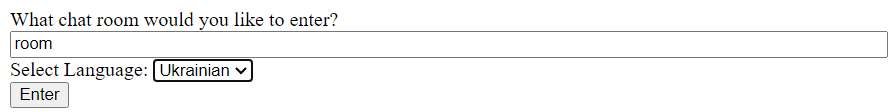
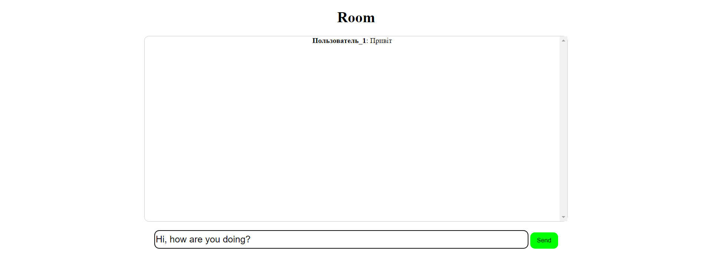
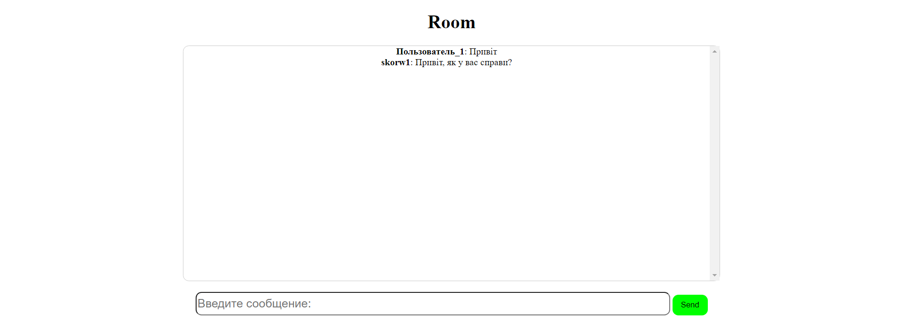

# Django Messenger

### Описание

Мессенджер с возможностью перевода в реальном времени. При заходе в руму, можно выбрать язык на который будут переводится сообщения

В самой комнате можно переписыватся в реальном времени с другими пользователями.

### Чему я научился, пока писал этот проект?

Я познакомился на практике с:

- Понятием вебсокетов, их примитивной работой
- Django Channels
